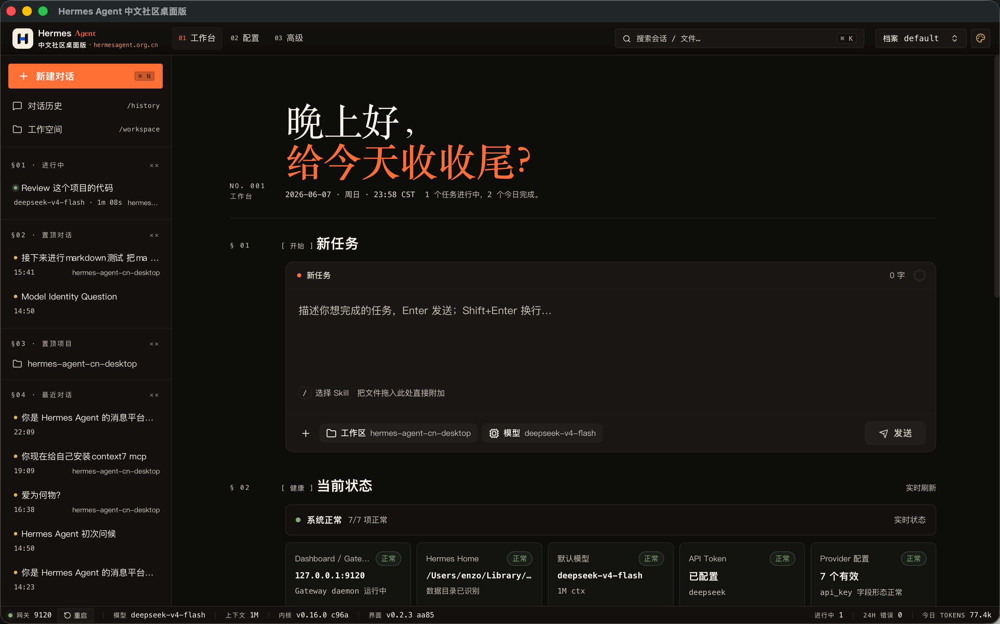
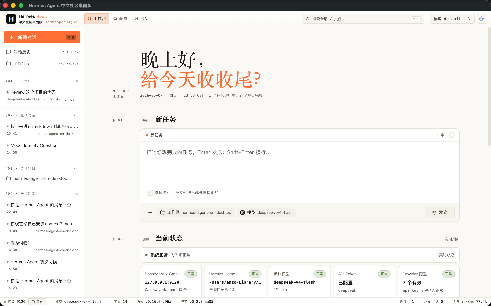
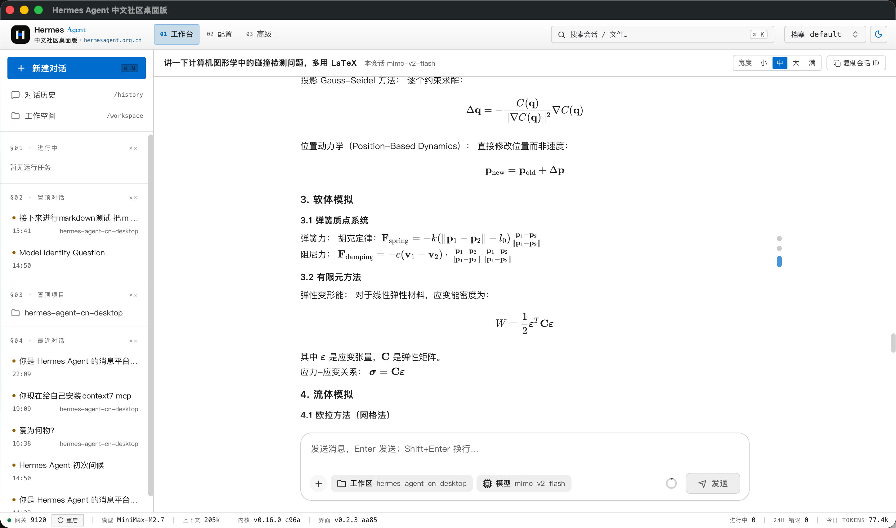
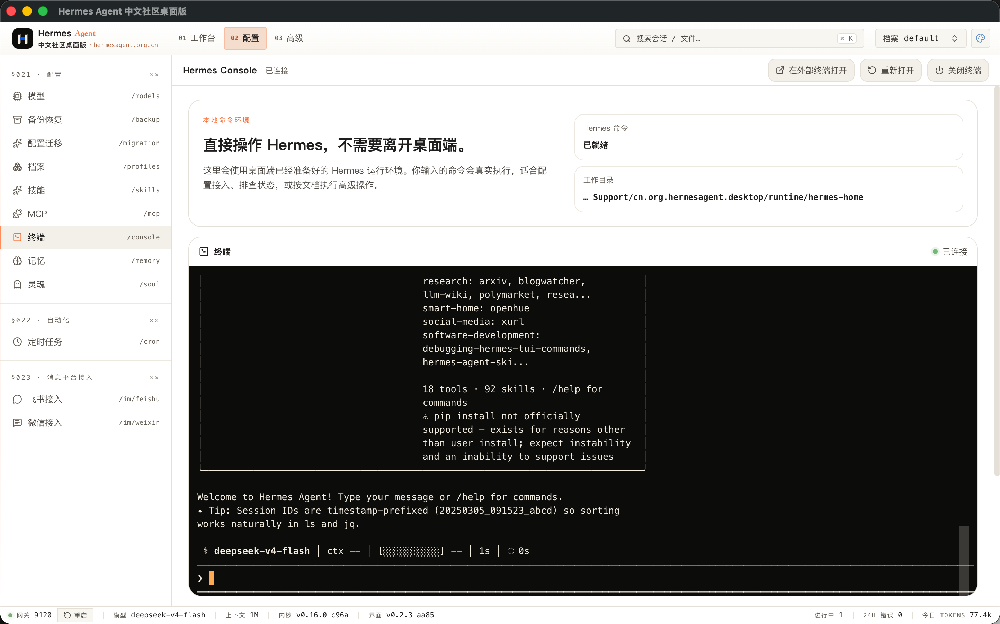
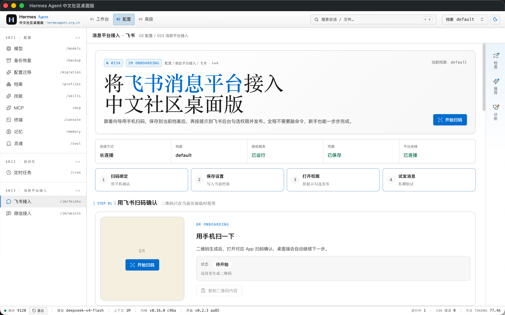
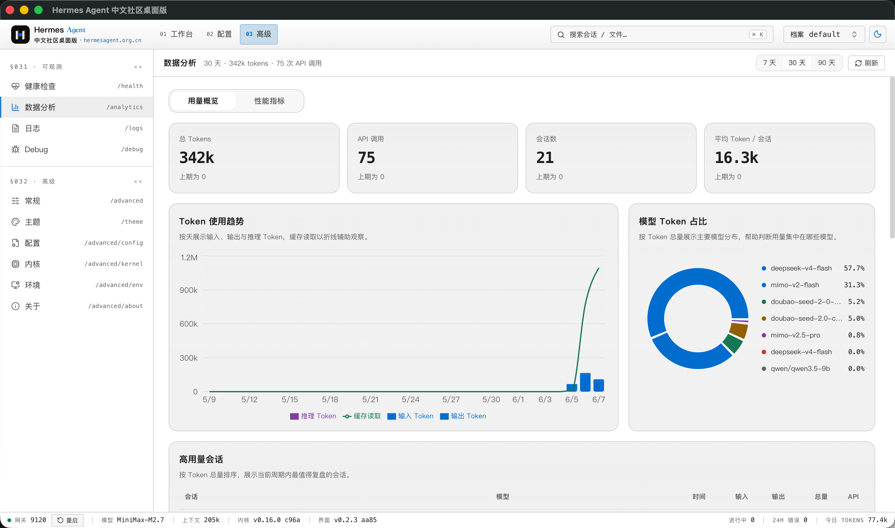
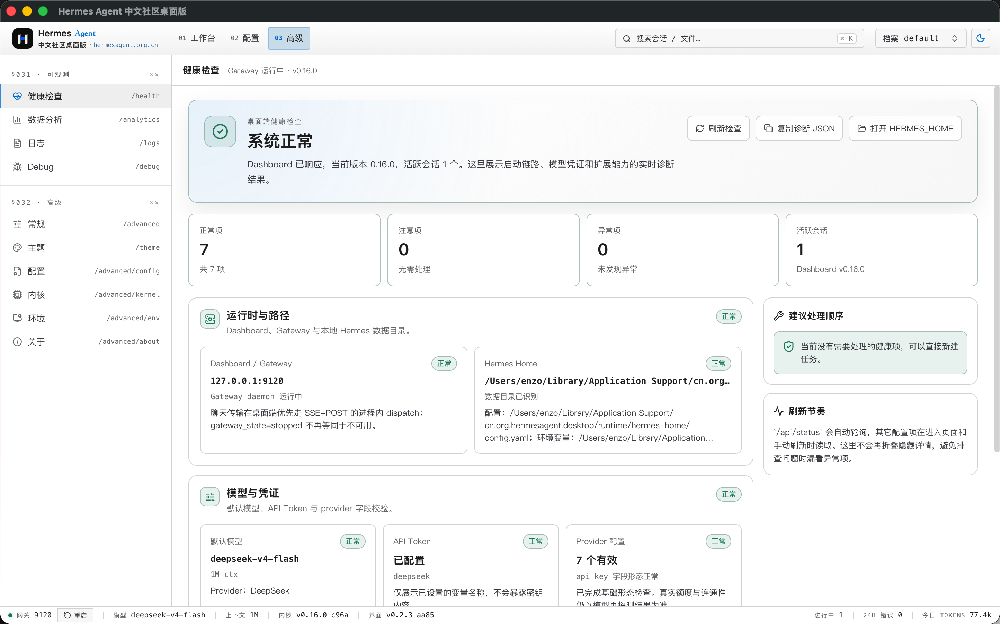

# Hermes Agent CN Desktop

[简体中文](./README.md) · English

[](https://github.com/Eynzof/Hermes-CN-Desktop/actions/workflows/web-test.yml)
[](https://github.com/Eynzof/Hermes-CN-Desktop/actions/workflows/rust-test.yml)
[](https://github.com/Eynzof/Hermes-CN-Desktop/actions/workflows/release-desktop.yml)
[](./LICENSE)
[](https://hermesagent.org.cn)

Hermes Agent CN Desktop is a desktop client from the Hermes Agent Chinese community, with native support for Windows and macOS. It is built with [Tauri v2](https://v2.tauri.app/), Rust, React, and TypeScript, and includes the Chinese community-modified Hermes Agent core from [Hermes-CN-Core](https://github.com/Eynzof/Hermes-CN-Core).

Official site and downloads: [desktop.hermesagent.org.cn](https://desktop.hermesagent.org.cn). The desktop app is part of the [Hermes Agent Chinese Community](https://hermesagent.org.cn) ecosystem, where the main site links to Chinese docs, practice guides, community entry points, and more ecosystem projects.

> Current release: `v0.5.1`. The project is still moving quickly. APIs, packaging, runtime distribution, and UI details may continue to change.

## Hermes Agent Chinese Community

Hermes Agent CN Desktop is maintained by the Hermes Agent Chinese Community. Visit the [community homepage](https://hermesagent.org.cn) for project updates, read the [Chinese docs](https://hermesagent.org.cn/docs), explore [practice guides](https://hermesagent.org.cn/practice-guides), or use the [community hub](https://hermesagent.org.cn/community) to find more discussion channels.

Scan the QR code below to join the Hermes Agent Chinese Community WeChat group. If the QR code expires, open the [latest WeChat group entry](https://hermesagent.org.cn/qr-entrance).

[](https://hermesagent.org.cn/qr-entrance)

## Demo

### Prototype preview

Browse the high-fidelity UI prototype gallery at [hermes-cn-ui-prototypes-sans.vercel.app](https://hermes-cn-ui-prototypes-sans.vercel.app/).

### Demo video

Click the preview image below, or open the [MP4 demo](./docs/assets/demo/hermes-agent-cn-desktop-demo.mp4) directly. README renderers do not consistently support local video embeds, so the preview links to the video file instead.

[](./docs/assets/demo/hermes-agent-cn-desktop-demo.mp4)

### Screenshots

These screenshots are synced from the landing repository and cover the workbench, archives, chat, LaTeX/Markdown rendering, task console, Feishu integration, usage stats, health, Skills, Memory, model provider setup, runtime diagnostics, and logs.

| Workbench, dark theme | Workbench, light theme |
| --- | --- |
|  |  |

| Archive workbench, dark theme | Archive workbench, light theme |
| --- | --- |
|  |  |

| Chat response workflow | Conversation history |
| --- | --- |
|  |  |

| LaTeX and Markdown rendering | Task console output |
| --- | --- |
|  |  |

| Feishu platform integration | Usage statistics and charts |
| --- | --- |
|  |  |

| System health status | Built-in Skills |
| --- | --- |
|  |  |

| Memory management | Model provider setup |
| --- | --- |
|  |  |

| Configuration | Runtime diagnostics |
| --- | --- |
|  |  |

| Logs | Project review workflow |
| --- | --- |
|  |  |

## Why this project exists

Hermes Agent already provides a local Dashboard. This repository focuses on the desktop experience around that Dashboard: native windows, local process management, file dialogs, managed runtime installation, runtime diagnostics, and a safer production transport layer for REST traffic plus a WS relay fallback.

This repository is the desktop shell. The agent runtime and Dashboard source live in [Hermes-CN-Core](https://github.com/Eynzof/Hermes-CN-Core).

## Highlights

- **One-click installation with a very low setup barrier**: adapted for Windows and macOS users, so you can install the app and start using it after configuring an API key or local model endpoint.
- **Lightweight and cross-platform**: Tauri uses the system WebView instead of bundling Chromium, keeping the installer small while supporting Windows and macOS.
- **Built-in independent Hermes Agent core**: the desktop app can install, update, verify, health-check, and roll back the local Hermes Agent core.
- **Agent-first UI**: chat, streaming responses, attachments, MCP tools, skills, memory, profiles, scheduled tasks, LaTeX/Mermaid rendering, and runtime health panels.
- **Chinese model and platform ecosystem**: support for major cloud model providers plus local deployments such as Ollama, vLLM, LM Studio, and llama.cpp, including Feishu integration setup; see the [Hermes Agent Chinese Community](https://hermesagent.org.cn) for more Chinese ecosystem content.
- **Production transport bridge**: Rust commands proxy REST requests and uploads, while the Gateway uses the official `/api/ws` transport with a Rust WS relay fallback when packaged WebViews block native sockets.

## Download

Installers are available from the [desktop website](https://desktop.hermesagent.org.cn) and are also published on the [GitHub Releases](https://github.com/Eynzof/Hermes-CN-Desktop/releases) page.

The current release includes:

- macOS Apple Silicon DMG: `Hermes.Agent.CN.Desktop_0.5.1_aarch64.dmg`
- macOS Intel DMG: `Hermes.Agent.CN.Desktop_0.5.1_x64.dmg`
- Windows x64 installer: `Hermes.Agent.CN.Desktop_0.5.1_x64-setup.exe`

Both the Windows and macOS installers include a bundled `Hermes-CN-Core` runtime. On first launch, the app initializes the local core from the bundled runtime first; managed runtime download/update is only used for upgrades or fallback repair.

## Requirements for development

- [Rust](https://rustup.rs/) stable
- [Node.js](https://nodejs.org/) 20+
- [pnpm](https://pnpm.io/) 9+
- [Hermes-CN-Core](https://github.com/Eynzof/Hermes-CN-Core) or an installed Hermes CLI for local Dashboard development

macOS also needs Xcode Command Line Tools:

```bash
xcode-select --install
```

## Quick start

Install dependencies:

```bash
pnpm install
```

Start the Hermes Dashboard in a separate terminal:

```bash
hermes dashboard --host 127.0.0.1 --port 9120 --no-open
```

Start the desktop app in development mode:

```bash
pnpm web:dev
cargo run
```

You can also let the Tauri dev command start the Vite dev server:

```bash
pnpm tauri:dev
```

## Build

```bash
# Production build for the current platform
pnpm tauri:build

# Debug build with debug symbols
pnpm tauri:build:debug
```

Build artifacts are written under `target/release/bundle/` or `target/debug/bundle/`.

## Repository layout

```text
├── src/                    Rust backend: Tauri commands, process management, runtime management
├── web/                    React frontend: Vite, TanStack Query, Jotai
├── packages/
│   ├── protocol/           Zod schemas, API contracts, IPC types
│   └── shared-ui/          Design tokens and shared UI components
├── static/                 Staged dashboard, runtime, and bundled skills for packaging
├── scripts/                Local development, runtime staging, and release staging scripts
├── .github/workflows/      CI and desktop release workflows
├── Cargo.toml              Rust crate configuration
├── tauri.conf.json         Tauri window, security, and bundle configuration
└── package.json            pnpm workspace root
```

## Common commands

| Command | Description |
| --- | --- |
| `pnpm web:dev` | Start the Vite dev server on port `9545` |
| `cargo run` | Compile and launch the Tauri desktop window |
| `pnpm typecheck` | Run TypeScript checks across the workspace |
| `pnpm test:unit` | Run Vitest unit tests |
| `cargo check` | Run Rust compile checks |
| `cargo test --all-features` | Run Rust tests |
| `pnpm tauri:build` | Build production desktop bundles |

## Quality gates

Before opening a pull request, please run the relevant checks:

```bash
pnpm typecheck
pnpm test:unit
cargo fmt --all -- --check
cargo clippy --all-targets -- -D warnings
cargo test --all-features --no-fail-fast
```

CI runs separate frontend and Rust workflows on `main` and pull requests targeting `main`.

## Release process

Releases use SemVer tags:

```text
v0.1.0-alpha.1
v0.1.0-beta.1
v0.1.0
v0.1.1
```

Pushing a `v*` tag triggers `.github/workflows/release-desktop.yml`, which builds and uploads desktop installers to GitHub Releases. Alpha, beta, and release-candidate tags are marked as GitHub pre-releases.

## Roadmap

The short-term roadmap is focused on:

- hardening the managed runtime installation and update path;
- improving first-run onboarding and provider setup;
- expanding diagnostics for Dashboard, gateway, MCP, skills, and model configuration;
- polishing macOS and Windows packaging behavior;
- documenting the desktop/runtime boundary for contributors.

## Star Track

Use the chart below to track this repository's GitHub Star growth over time.

[](https://www.star-history.com/#Eynzof/Hermes-CN-Desktop&Date)

## Contributing

Issues and pull requests are welcome. Please read [CONTRIBUTING.md](./CONTRIBUTING.md) before contributing. To learn more about the Chinese community, docs, and practice guides first, visit the [Hermes Agent Chinese Community](https://hermesagent.org.cn), [Chinese docs](https://hermesagent.org.cn/docs), and [practice guides](https://hermesagent.org.cn/practice-guides).

For security-sensitive reports, please follow [SECURITY.md](./SECURITY.md) instead of opening a public issue.

## License

Noncommercial use of this project is licensed under the [PolyForm Noncommercial License 1.0.0](./LICENSE). Commercial use, commercial distribution, commercial integration, hosted resale, or use as part of a commercial product or service requires a separate commercial license from Qingdao Wanderminds Network Technology Co., Ltd.; contact lijiale@wanderminds.cn for authorization.
