# Hermes Agent CN Desktop

简体中文 · [English](./README.en-US.md)

[](https://github.com/Eynzof/hermes-agent-cn-desktop/actions/workflows/web-test.yml)
[](https://github.com/Eynzof/hermes-agent-cn-desktop/actions/workflows/rust-test.yml)
[](https://github.com/Eynzof/hermes-agent-cn-desktop/actions/workflows/release-desktop.yml)
[](./LICENSE)

Hermes Agent CN Desktop 是 Hermes Agent 中文社区推出的桌面客户端，原生支持Windows与MacOS系统。项目基于 [Tauri v2](https://v2.tauri.app/)、Rust、React 和 TypeScript 构建，包含 [hermes-agent-cn](https://github.com/Eynzof/hermes-agent-cn) 中文社区修改版的 Hermes Agent 内核。

> 当前版本是 `v0.2.1`。项目仍处于 alpha 阶段，API、打包流程、运行时分发策略和界面细节都可能在稳定版发布前继续调整。

## 演示

### 原型图预览

可以在 [hermes-cn-ui-prototypes-sans.vercel.app](https://hermes-cn-ui-prototypes-sans.vercel.app/) 浏览高保真 UI 原型图。

### 演示视频

点击下方预览图，或直接打开 [MP4 演示视频](./docs/assets/demo/hermes-agent-cn-desktop-demo.mp4)。README 渲染器对本地视频内嵌播放支持不稳定，因此这里用可点击预览图链接到视频文件。

[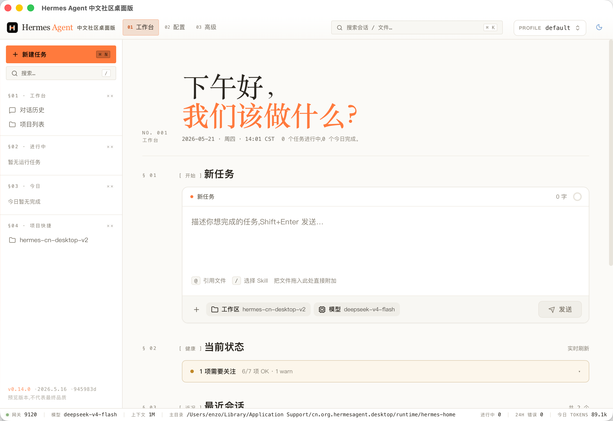](./docs/assets/demo/hermes-agent-cn-desktop-demo.mp4)

### 界面截图

下面的截图展示了工作台、明暗主题、配置、内置 Skills、模型服务商配置、记忆管理、运行时诊断、日志、对话历史、聊天回复和项目 Review 工作流。

| 工作台（浅色主题） | 工作台（深色主题） |
| --- | --- |
|  | 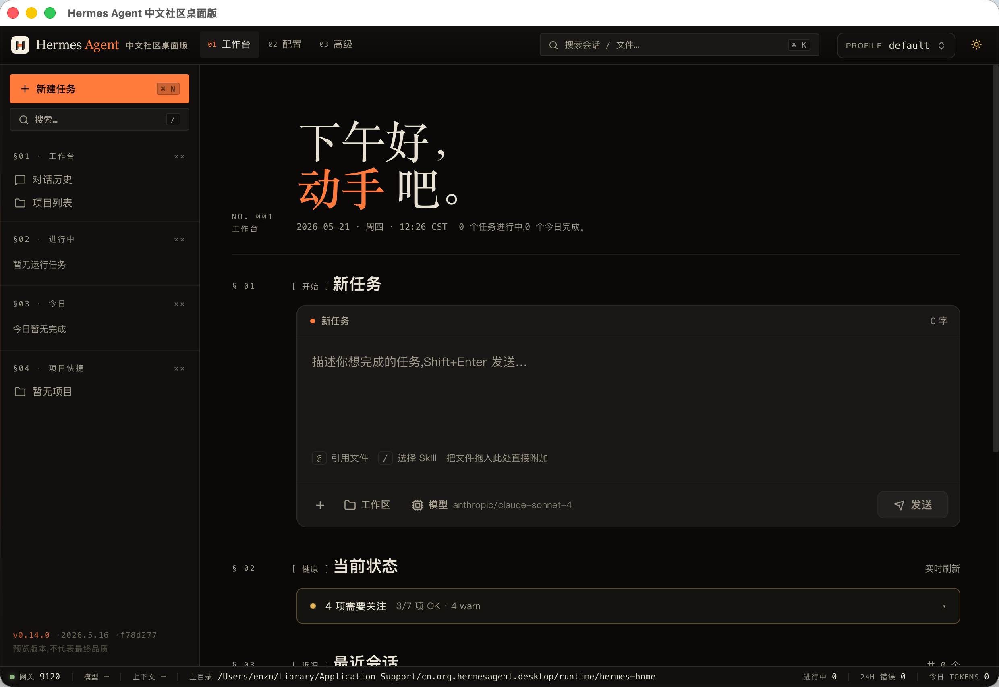 |

| 配置总览 | 内置 Skills |
| --- | --- |
| 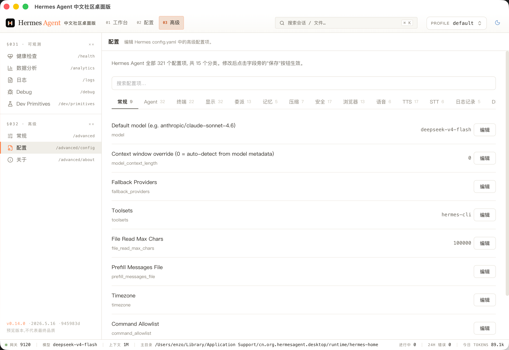 | 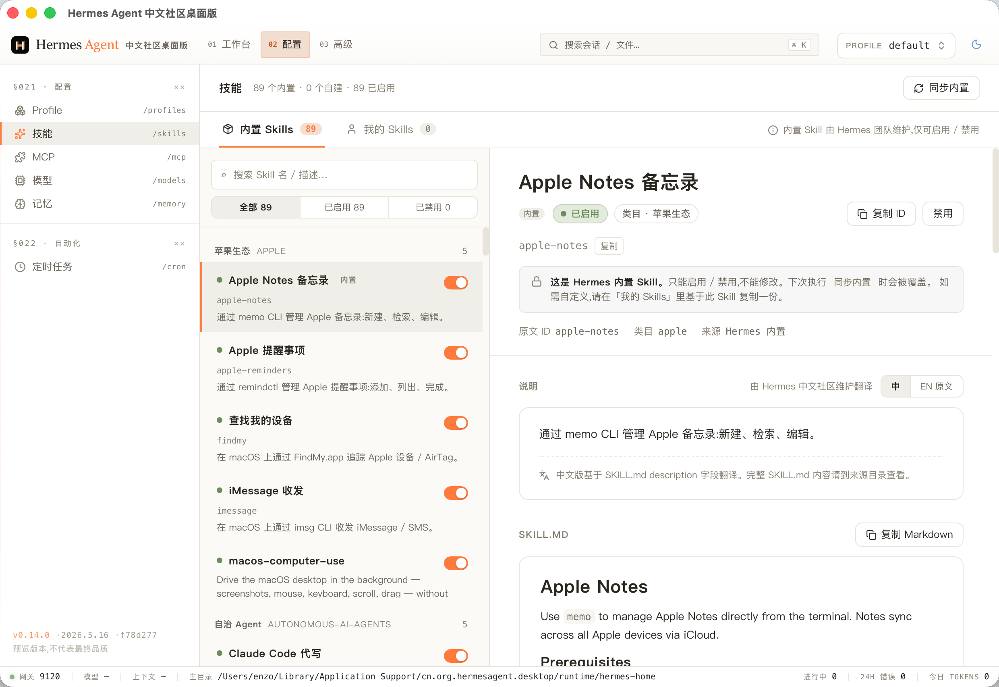 |

| 模型服务商配置 | 记忆管理 |
| --- | --- |
| 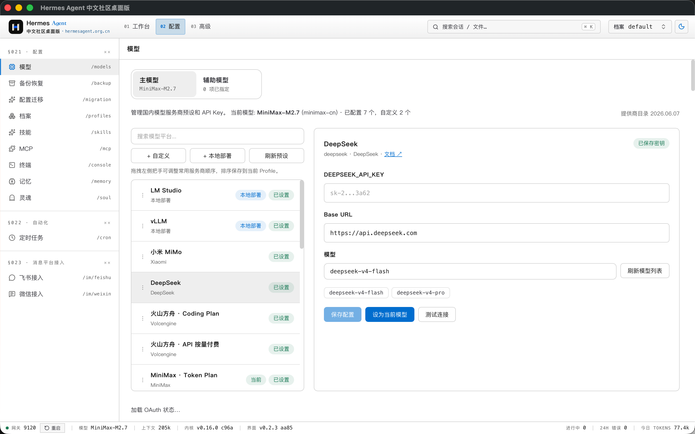 | 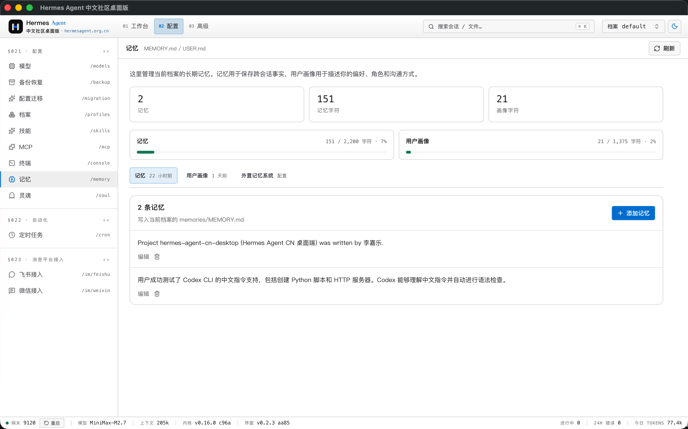 |

| 运行时诊断 | 日志查看 |
| --- | --- |
| 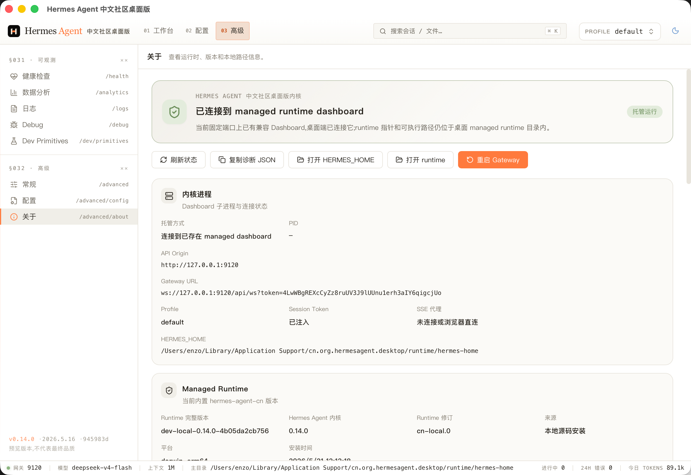 | 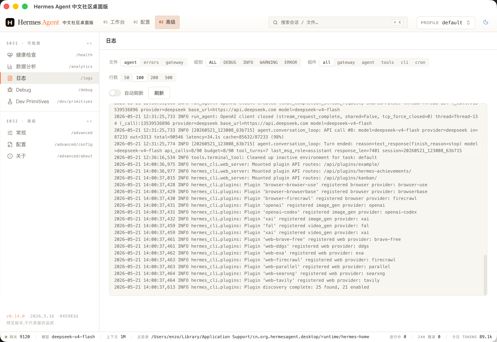 |

| 对话历史 | 聊天回复 |
| --- | --- |
| 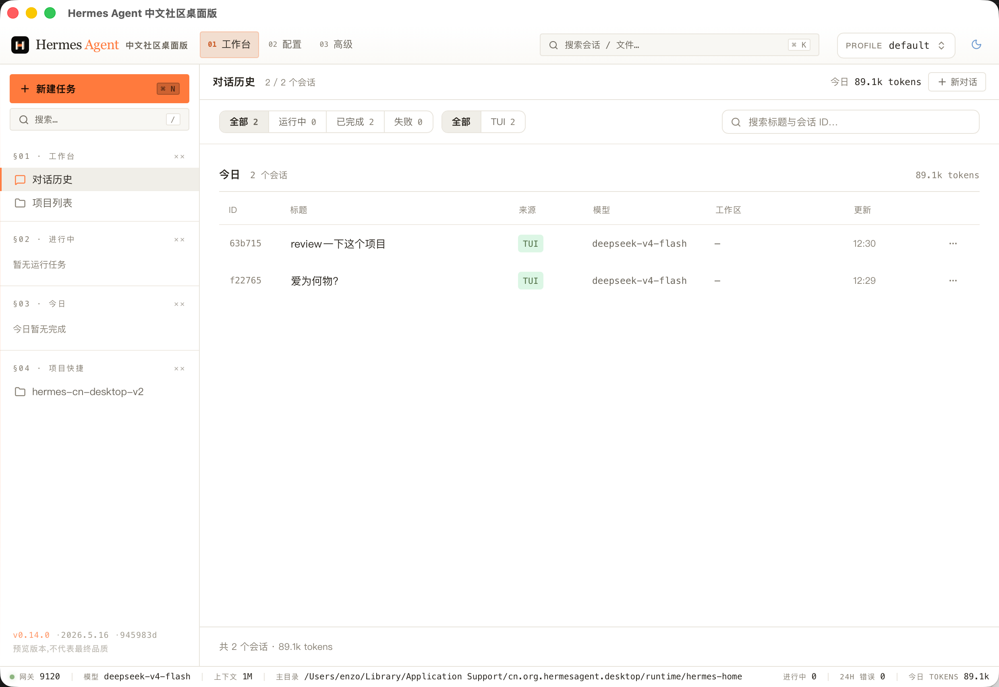 | 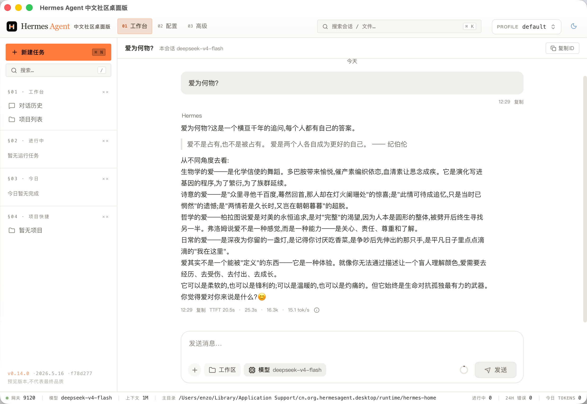 |

| 项目 Review 工作流 |
| --- |
| 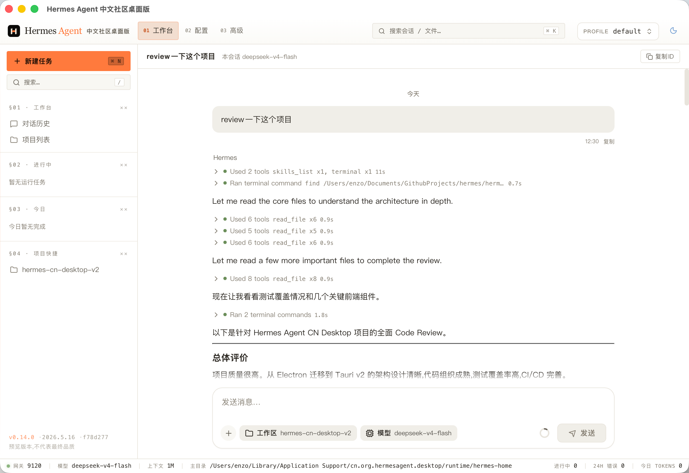 |

## 项目定位

Hermes Agent 已经提供本地 Dashboard。本仓库专注于 Dashboard 之外的桌面体验：原生窗口、本地进程管理、文件对话框、托管运行时安装、运行时诊断，以及生产模式下更安全的 REST 和 SSE 代理层。

本仓库是桌面端外壳。Agent runtime 和 Dashboard 源码位于 [hermes-agent-cn](https://github.com/Eynzof/hermes-agent-cn)。

## 亮点

- **一键安装，使用门槛极低**：针对Windows系统用户适配，下载安装后配置API-KEY即可使用。
- **轻量，跨平台**：Tauri 使用系统 WebView，不需要随应用打包 Chromium，安装包体积小，支持Windows及MacOS。
- **内置独立Hermes Agent内核**：桌面端支持安装、更新、签名校验、健康检查和回滚本地 Hermes Agent内核。
- **面向 Agent 的完整 UI**：支持聊天、流式输出、附件、MCP 工具、Skills、Memory、Profiles、定时任务和运行时健康面板。
- **生产级传输桥**：生产模式下通过 Rust command 代理 REST、上传和 SSE，绕过 WebView CORS 限制，并集中处理鉴权。
- **YOLO 模式开关**：「设置 → 常规」底部独立的「高风险操作」区提供开关，开启需二次确认，自动批准危险命令（对应后端 `HERMES_YOLO_MODE`），切换后自动重启内核生效，详见 [docs/yolo-mode.md](./docs/yolo-mode.md)。

## 下载

预发布安装包会发布在 [GitHub Releases](https://github.com/Eynzof/hermes-agent-cn-desktop/releases) 页面。

当前 alpha 版本包含：

- macOS Apple Silicon DMG：`Hermes.Agent.CN.Desktop_0.2.1_aarch64.dmg`
- Windows x64 安装器：`Hermes.Agent.CN.Desktop_0.2.1_x64-setup.exe`

当前 Windows 与 macOS 安装包都会预置 `hermes-agent-cn` runtime，安装后优先从包内 runtime 完成本地内核初始化；托管 runtime 下载与更新流程只作为升级或兜底路径使用。

## 开发环境要求

- [Rust](https://rustup.rs/) stable
- [Node.js](https://nodejs.org/) 20+
- [pnpm](https://pnpm.io/) 9+
- [hermes-agent-cn](https://github.com/Eynzof/hermes-agent-cn) 或本机已安装的 Hermes CLI，用于本地 Dashboard 开发

macOS 还需要安装 Xcode Command Line Tools：

```bash
xcode-select --install
```

## 快速开始

安装依赖：

```bash
pnpm install
```

另开一个终端启动 Hermes Dashboard：

```bash
hermes dashboard --host 127.0.0.1 --port 9120 --no-open
```

启动桌面端开发模式：

```bash
pnpm web:dev
cargo run
```

也可以让 Tauri dev 命令自动启动 Vite：

```bash
pnpm tauri:dev
```

## 构建

```bash
# 为当前平台构建生产包
pnpm tauri:build

# 构建带调试信息的 Debug 包
pnpm tauri:build:debug
```

构建产物位于 `target/release/bundle/` 或 `target/debug/bundle/`。

## 仓库结构

```text
├── src/                    Rust 后端：Tauri commands、进程管理、runtime 管理
├── web/                    React 前端：Vite、TanStack Query、Jotai
├── packages/
│   ├── protocol/           Zod schema、API 契约、IPC 类型
│   └── shared-ui/          设计 token 和共享 UI 组件
├── static/                 打包时注入的 Dashboard、runtime、内置 skills
├── scripts/                本地开发、runtime staging、release staging 脚本
├── .github/workflows/      CI 和桌面端发布流水线
├── Cargo.toml              Rust crate 配置
├── tauri.conf.json         Tauri 窗口、安全和打包配置
└── package.json            pnpm workspace root
```

## 常用命令

| 命令 | 说明 |
| --- | --- |
| `pnpm web:dev` | 启动 Vite dev server，默认端口 `9545` |
| `cargo run` | 编译并启动 Tauri 桌面窗口 |
| `pnpm typecheck` | 运行 TypeScript 类型检查 |
| `pnpm test:unit` | 运行 Vitest 单元测试 |
| `cargo check` | 运行 Rust 编译检查 |
| `cargo test --all-features` | 运行 Rust 测试 |
| `pnpm tauri:build` | 构建生产桌面包 |

## 质量门禁

提交 Pull Request 前，建议运行相关检查：

```bash
pnpm typecheck
pnpm test:unit
cargo fmt --all -- --check
cargo clippy --all-targets -- -D warnings
cargo test --all-features --no-fail-fast
```

CI 会在 `main` 和指向 `main` 的 Pull Request 上分别运行前端和 Rust 测试流水线。

## 发布流程

版本使用 SemVer tag：

```text
v0.1.0-alpha.1
v0.1.0-beta.1
v0.1.0
v0.1.1
```

推送 `v*` tag 后会触发 `.github/workflows/release-desktop.yml`，自动构建并上传桌面端安装包到 GitHub Releases。Alpha、beta 和 release candidate tag 会被标记为 GitHub 预发布。

## Roadmap

近期重点包括：

- 加固托管 runtime 的安装、更新和回滚链路；
- 改进首次启动引导和模型服务商配置体验；
- 扩展 Dashboard、gateway、MCP、skills 和模型配置诊断；
- 打磨 macOS 与 Windows 的打包和安装行为；
- 完善桌面端与 runtime 边界文档，降低贡献门槛。

## Star Track

可以通过下面的趋势图查看本仓库 GitHub Star 的增长变化。

[](https://www.star-history.com/#Eynzof/hermes-agent-cn-desktop&Date)

## 贡献

欢迎提交 Issue 和 Pull Request。参与贡献前请阅读 [CONTRIBUTING.md](./CONTRIBUTING.md)。

如果要报告安全问题，请遵循 [SECURITY.md](./SECURITY.md)，不要直接创建公开 Issue。

## 许可

本项目的非商业使用遵守 [PolyForm Noncommercial License 1.0.0](./LICENSE)。商业使用、商业分发、商业集成、托管销售或作为商业产品组成部分使用，需提前获得青岛万德缦思网络科技有限公司的单独商业授权；授权联系邮箱：lijiale@wanderminds.cn。
